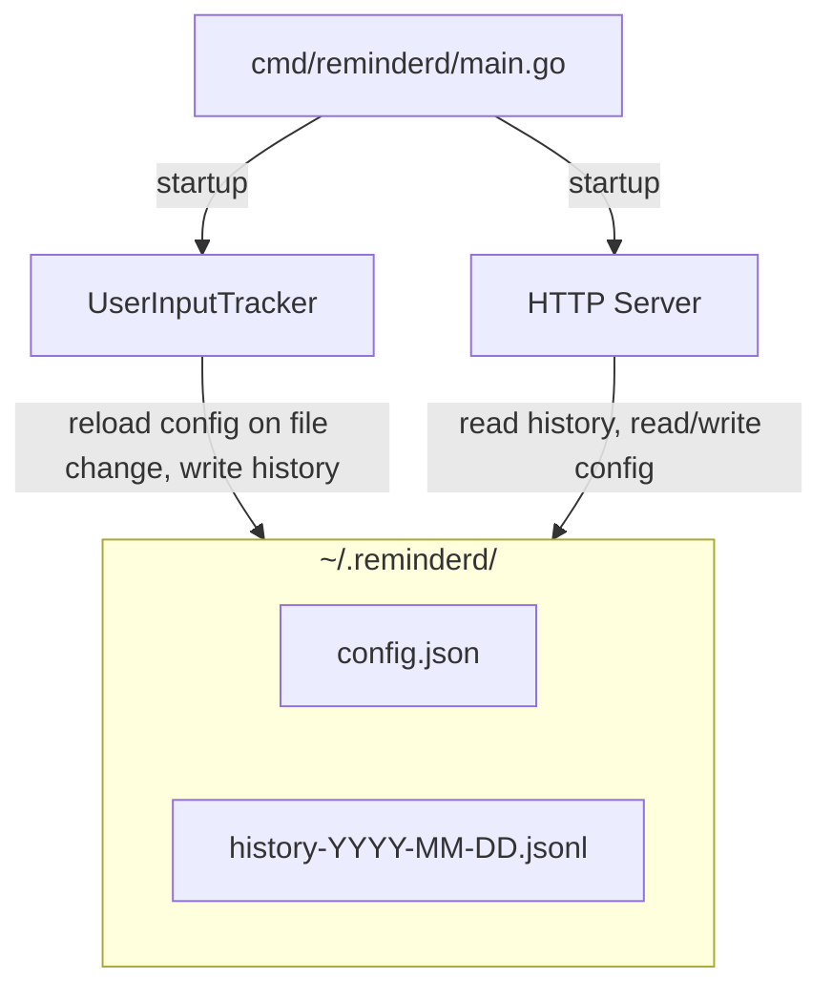

# reminderd

A background daemon that monitors mouse/keyboard input
and reminds you to take a break.

The generic service name leaves room for other reminder types in the future.

## How it works

- Polls the OS for the time since the last keyboard/mouse event.
- If you are continuously active for 60 minutes by default,
  it sends a desktop notification.
- After the reminder, if the user keeps working, remind again with
  exponential backoff: 5m, 10m, 20m, ...
- The timer resets once you actually take a break (2 minutes of no input).
- Records activity history to daily files in `~/.reminderd/`.
- Serves a web UI with activity chart and settings at <http://localhost:20902>.

## Platforms

- macOS 13 Ventura (Core Graphics API)
- Windows 10/11 (`GetLastInputInfo` from user32.dll)
- Linux Mint 22.3 "Zena" (X11, `XScreenSaverQueryInfo`)

## Web UI

Open <http://localhost:20902> in a browser. The web UI has two tabs:

### Configuration

View and edit all settings from the browser.
Each field has a tooltip explaining its meaning and recommended values.
Changes take effect within one poll interval, no restart needed.

On first run, the app creates `~/.reminderd/config.json` with defaults:

```json
{
	"ContinuousActiveLimit": "60m",
	"IdleDurationToConsiderBreak": "2m",
	"KeyboardMouseInputPollInterval": "10s",
	"NotificationInitialBackoff": "5m",
	"WebUIPort": 20902
}
```

### User activity history

A bar chart showing when you were active or idle.
You can choose a time range (Last 1h, 4h, 12h, 24h, 2d, 7d, 30d, 6m, 1y, all time).
Example summary: Last 4h | Active: 2h32m (63%) | Reminders: 2
Hover over any bar to see the active/total duration breakdown.

Activity is recorded to daily files in `~/.reminderd/` (e.g. `history-2026-04-03.jsonl`).
At daily rollover, the previous day's file is compacted:
only the first and last record of each consecutive state run are kept.

History is kept forever. Estimated storage:
~300 KB/year (compacted), ~42 MB/year (uncompacted, 10s poll, 8h/day).

## Usage

```bash
# Build
go build -o reminderd ./cmd/reminderd

# Run in background
./reminderd &
```

## Design



### Components

1. **Idle detector** (`pkg/driver/userinput/`, per-platform):
   one method `IdleSeconds() (float64, error)`.
   Three implementations via build tags (darwin, windows, linux).

2. **Notifier** (`pkg/driver/notify/`, per-platform):
   one method `Notify(title, message string) error`.
   Shells out to `osascript` / PowerShell / `notify-send`.

3. **Config store** (`pkg/driver/config/`):
   reads and writes `~/.reminderd/config.json`.
   Checks file modification time each tick; reloads only when changed.
   Missing fields are merged with defaults and written back.

4. **History store** (`pkg/driver/history/`):
   appends JSONL entries to daily files (`history-YYYY-MM-DD.jsonl`).
   Compacts the previous day's file on rollover.
   Reads entries by time range for the chart.

5. **HTTP server** (`pkg/driver/httpsvr/`):
   serves the usage chart page and config editor.
   Endpoints: `GET /`, `GET /api/history`, `GET /api/config`, `POST /api/config`.

6. **UserInputTracker** (`pkg/logic/`, platform-independent):
   polls idle detector on a configurable interval (default 10s).
   Writes history entries each tick. Reloads config on file change.
   If idle < threshold: accumulate active duration.
   If idle >= threshold: reset everything.
   If active >= limit: send reminder, then exponential backoff.

7. **`cmd/reminderd/main.go`**: creates `~/.reminderd/`, wires all components, starts
   the HTTP server and tracker loop.

## Roadmap

- **v0.0.3**: minimal UI with system tray, install as a service (auto-start on boot).
