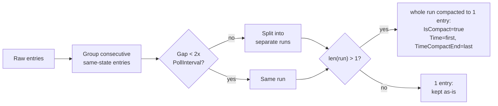
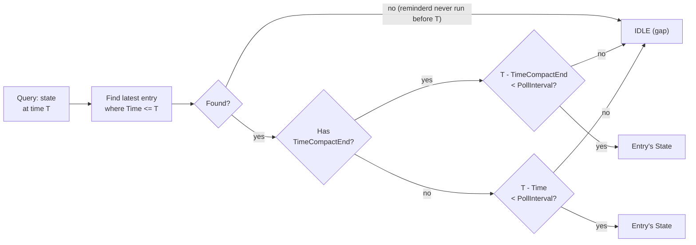
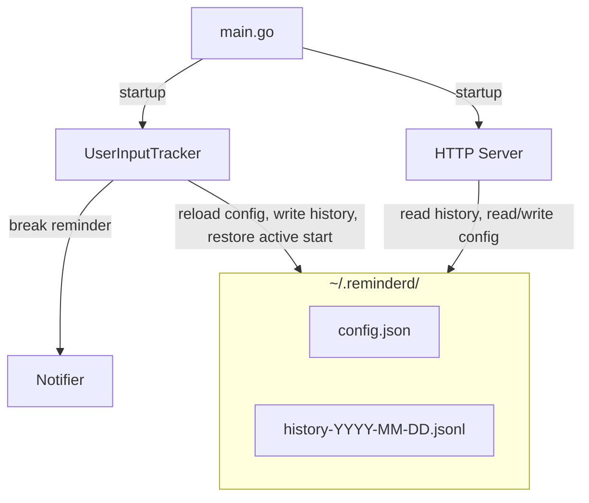

# reminderd

A background daemon that checks how long since the last mouse/keyboard event
and **reminds you to take a break after sitting for too long**.

The generic service name leaves room for other reminder types in the future.

## Usage

```bash
# Build
go build -o reminderd ./cmd/reminderd

# Run in background
./reminderd &
```

## How it works

- Polls the OS for the time since the last keyboard/mouse event.
- If you are continuously active for the configured limit (default 45m),
  it sends a desktop notification.
- After the reminder, if you keep working, it reminds again with
  exponential backoff starting at the configured initial backoff (default 5m),
  then doubling: 10m, 20m, ...
- The timer resets once you take a break
  (idle for the configured threshold, default 2m).
- Records activity history to daily files in `~/.reminderd/`.
- Serves a web UI with an activity chart and settings at <http://localhost:20902>.

## Web UI

Open <http://localhost:20902> in a browser. The web UI has three tabs:


### Activity History

A bar chart showing when you were active or idle.
You can choose a time range (Last 1h, 4h, 12h, 24h, 2d, 7d, 30d, 6m, 1y, all time).
Example summary: Last 4h | Active: 2h32m (63%)
Hover over any bar to see the active/total duration breakdown.

Activity is recorded to daily files in `~/.reminderd/` (e.g. `history-2026-04-03.jsonl`).
At daily rollover, the previous day's file is compacted:
each consecutive same-state run becomes one self-describing entry.

History is kept forever. Estimated storage:
~300 KB/year (compacted), ~42 MB/year (uncompacted, 10s poll, 8h/day).

### Configuration

View and edit all settings from the browser.
Each field has a tooltip explaining its meaning and recommended values.
Changes take effect within one poll interval (10s), no restart needed.

On first run, the app creates `~/.reminderd/config.json` with defaults:

```json
{
	"ContinuousActiveLimit": "45m",
	"IdleDurationToConsiderBreak": "2m",
	"NotificationInitialBackoff": "5m",
	"WebUIPort": 20902
}
```

### Run on startup

A checkbox lets you register reminderd to start automatically when you log in.

- **Windows:** adds an entry in the registry, visible in Task Manager's Startup tab.
- **macOS:** creates a Launch Agent in `~/Library/LaunchAgents/`, visible in System Settings > General > Login Items.
- **Linux:** creates an XDG autostart `.desktop` file in `~/.config/autostart/`.

### Notification

Send a test notification to verify that desktop alerts are working on your system.

TODO: allow user to customize notification content.

## Log Compaction and Activity State

### Log Compaction

`CompactHistory` collapses each consecutive same-state run into one entry
with `IsCompact: true` and `TimeCompactEnd` set.
If the gap between two adjacent entries exceeds 2x PollInterval (20s),
the run is split (gap detection).



### User Activity State

Each entry represents one poll tick, so it covers `[Time, Time + PollInterval)`.  
A compact entry covers `[Time, TimeCompactEnd + PollInterval)`.  
Gaps between entries are treated as IDLE.



### Restore Active Start (on process restart)

On startup, `restoreActiveStart` walks backwards from `time.Now`
to find where the current active session started.
Short idle periods (< `IdleDurationToConsiderBreak`) don't reset the session.
A gap longer than the threshold means the user took a real break,
so only the activity after that break counts.

## Design



## Platforms

- [x] Windows 10/11 (`GetLastInputInfo` from user32.dll)
- [x] macOS 13 Ventura (Core Graphics API)
- [ ] Linux Mint 22.3 "Zena" (X11, `XScreenSaverQueryInfo`, `notify-send`) — implemented, not tested

## Roadmap

- Minimal UI with system tray
