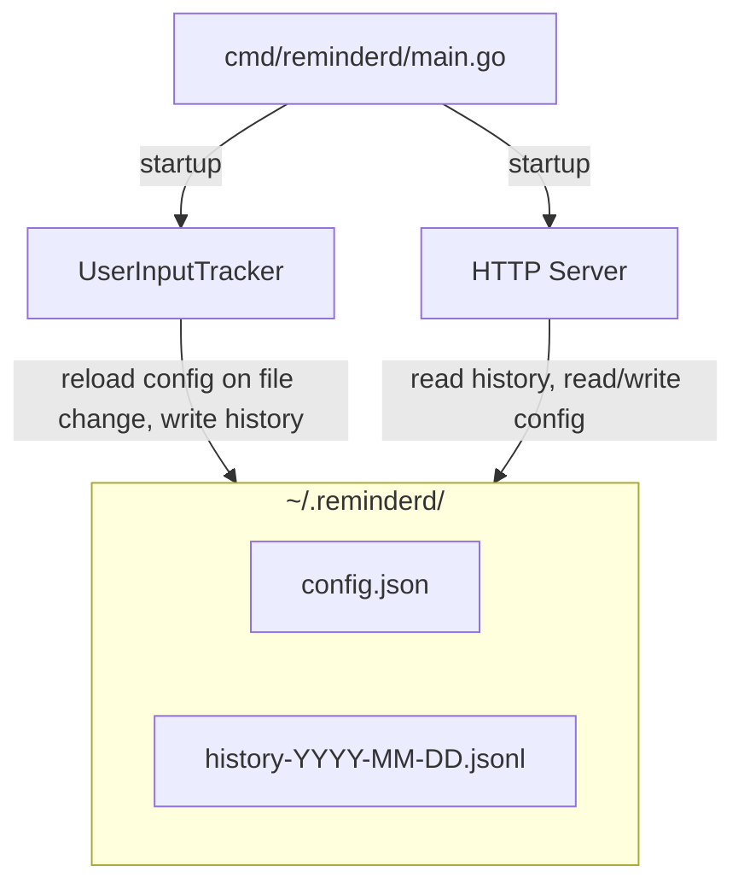

# v0.0.2: Activity History and Usage Chart

## Decisions

| Question            | Decision                                                                                                                  |
|---------------------|---------------------------------------------------------------------------------------------------------------------------|
| Storage format      | JSONL: `{"Time":"RFC3339+07:00","State":"active\|idle"}`, one line per active tick, one line on idle transition            |
| Compaction          | Append-only; compact previous day on rollover + last uncompacted file on startup (keep first + last of each consecutive state run) |
| File structure      | Rolling daily files: `~/.reminderd/history-YYYY-MM-DD.jsonl`                                                              |
| Config              | `~/.reminderd/config.json`, reload on file change (check mod time each tick), editable via file or web UI. Missing fields merge with defaults and get written back. |
| Chart               | Localhost HTTP server, HTML page                                                                                          |
| Retention           | None, keep forever (~300 KB/year compacted, ~42 MB/year uncompacted)                                                      |
| Configurable values | ContinuousActiveLimit, IdleDurationToConsiderBreak, KeyboardMouseInputPollInterval, NotificationInitialBackoff, WebUIPort |
| Chart style         | Stacked bars showing % active vs idle. Bar width adapts to time range (per hour for a day, per minute for an hour, etc.) |

## High-level design

### Component diagram



### Components to build

1. **Config** (`pkg/logic/`): a struct with the 5 configurable fields.
   Loaded from `~/.reminderd/config.json` on startup.
   Each tick, check file mod time; reload only when changed.
   If the file doesn't exist, create it with defaults.
   If missing fields, merge with defaults and write back.
   If JSON is invalid, keep previous values.

2. **HistoryWriter** (`pkg/logic/`): interface with `WriteEntry(time, state)`.
   Called by `UserInputTracker.Tick` each active tick and on break detection.
   Platform-independent.

3. **HistoryWriter file implementation** (`pkg/driver/history/`):
   appends JSONL lines to daily files. On day rollover, compacts yesterday's
   file (keep first + last of each consecutive state run).

4. **HistoryReader** (`pkg/logic/`): interface with `ReadRange(start, end time.Time) []Entry`.
   Reads across multiple daily files if the range spans days.
   Used by the HTTP handler to load data for the chart.
   All times in Asia/Ho_Chi_Minh (+07:00). Default range: today.

5. **HTTP server** (`pkg/driver/httpsvr/`): serves usage chart page and
   config editor. Endpoints:

- `GET /`: HTML page with usage chart (JS reads from API)
- `GET /api/history?start=RFC3339&end=RFC3339`: returns history as JSON (start default: today 00:00+07:00, end is optional)
- `GET /api/config`: returns current config
- `POST /api/config`: updates config.json

6. **UserInputTracker changes**: replace constants with config fields,
   accept a `HistoryWriter` dependency, re-read config each tick.

### Risks and mitigations

- **File corruption on crash**: append-only writes minimize risk.
  Worst case: one truncated line. Reader should skip malformed lines.
- **Config hot-reload race**: HTTP server writes config, ticker reads it.
  Use a mutex or accept that a rare bad read keeps previous config.
- **Backward compatibility**: existing users have no `~/.reminderd/`.
  First run creates it and the default config. No migration needed.

## Detailed implementation plan

> This section has not been reviewed with the same rigor as the high-level design.
> Verify details before relying on them.

### Phase 1: Config (no dependencies on other phases)

**`pkg/model/model.go`** (new file)
- `Config` struct with 5 fields: `ContinuousActiveLimit`, `IdleDurationToConsiderBreak`,
  `KeyboardMouseInputPollInterval`, `NotificationInitialBackoff` (all `time.Duration`),
  `WebUIPort` (int).
- `DefaultConfig()` function returning the default values.
- `HistoryEntry` struct: `Time time.Time`, `State string`.
- Constants: `StateActive = "active"`, `StateIdle = "idle"`.

**`pkg/logic/interface.go`** (modify)
- Add `ConfigStore` interface:
  - `Load() (Config, error)`: read config, merge defaults, write back missing fields.
  - `LoadIfChanged() (Config, bool, error)`: check mod time, reload only if changed.
  - `Save(Config) error`: write config to file.
- Add `HistoryWriter` interface:
  - `WriteEntry(HistoryEntry) error`: append a line to today's file.
  - `CompactPrevious() error`: compact the most recent non-today file.
- Add `HistoryReader` interface:
  - `ReadRange(start, end *time.Time) ([]HistoryEntry, error)`: read entries in range.
    `end` is a pointer (nil = no limit).

**`pkg/logic/interface_mock.go`** (modify)
- Add `MockConfigStore`, `MockHistoryWriter`, `MockHistoryReader`.

### Phase 2: History file driver (depends on Phase 1 for types)

**`pkg/driver/history/history.go`** (new file)
- `FileStore` struct: holds `dir` string (`~/.reminderd/`), `currentDate` string,
  `currentFile *os.File`.
- Implements `HistoryWriter` and `HistoryReader`.
- `WriteEntry`: if date changed from `currentDate`, close old file, call `CompactPrevious`,
  open new file. Append JSON line + newline.
- `CompactPrevious`: find the most recent `history-*.jsonl` file before today.
  Read all lines, keep first + last of each consecutive state run, rewrite.
- `ReadRange`: determine which daily files overlap the range,
  open each, scan lines, filter by time, skip malformed lines.

### Phase 3: Config file driver (depends on Phase 1 for types)

**`pkg/driver/config/config.go`** (new file)
- `FileConfigStore` struct: holds `path` string, `lastModTime time.Time`.
- `Load`: read file, `json.Unmarshal` into struct pre-filled with defaults.
  Write full config back (fills missing fields). If file doesn't exist, create with defaults.
- `LoadIfChanged`: `os.Stat` the file, compare mod time. If unchanged, return `false`.
  Otherwise call `Load`.
- `Save`: marshal config with indent, write to file.

### Phase 4: Refactor UserInputTracker (depends on Phase 1)

**`pkg/logic/app.go`** (modify)
- Remove constants `ContinuousActiveLimit`, `IdleThreshold`, `InitialBackoff`, `PollInterval`.
- Add fields to `UserInputTracker`:
  - `Config Config`
  - `ConfigStore ConfigStore`
  - `HistoryWriter HistoryWriter`
  - `lastConfigCheck time.Time` (to avoid checking mod time every tick,
    though `os.Stat` is cheap)
- `Run`: load config on startup, call `HistoryWriter.CompactPrevious()`,
  use `Config.KeyboardMouseInputPollInterval` for ticker interval.
  Recreate ticker if poll interval changes on config reload.
- `Tick`: at start, call `ConfigStore.LoadIfChanged()` and update fields.
  After idle/active detection, call `HistoryWriter.WriteEntry(...)`.
  Use config fields instead of constants for thresholds.

**`pkg/logic/app_test.go`** (modify)
- Update tests to use config struct instead of constants.
- Add tests for history writing on tick and config reload behavior.

### Phase 5: HTTP server (depends on Phases 1-3)

**`pkg/driver/httpsvr/httpsvr.go`** (new file)
- `Server` struct: holds `ConfigStore`, `HistoryReader`, `port int`.
- `GET /`: serves embedded HTML page (use `embed.FS`).
- `GET /api/history`: parse `start`/`end` query params (RFC3339),
  default start to today 00:00+07:00, call `HistoryReader.ReadRange`, return JSON.
- `GET /api/config`: call `ConfigStore.Load`, return JSON.
- `POST /api/config`: decode JSON body, validate, call `ConfigStore.Save`.

**`web/index.html`** (new file)
- Embedded in the binary via `//go:embed`.
- JS: fetch `/api/history`, render stacked bars using canvas or inline SVG.
- JS: fetch `/api/config`, show form, POST changes.
- Date picker for time range selection, defaults to today.

### Phase 6: Wire everything in main (depends on all above)

**`cmd/reminderd/main.go`** (modify)
- Create `~/.reminderd/` dir if not exists.
- Instantiate `FileConfigStore`, load initial config.
- Instantiate `FileStore` (history).
- Instantiate `Server` with config store and history reader.
- Start HTTP server in a goroutine.
- Pass config store and history writer to `UserInputTracker`.
- Start tracker loop.

### Execution order

Phases 1-3 can be done in parallel (1 first, then 2 and 3 in parallel).
Phase 4 depends on 1. Phase 5 depends on 1-3. Phase 6 depends on all.

```
Phase 1 (model + interfaces)
  ├── Phase 2 (history driver)
  ├── Phase 3 (config driver)
  └── Phase 4 (refactor tracker)
        └── Phase 5 (HTTP server)
              └── Phase 6 (wire main.go)
```

## Checklist

- [x] Step 1: Understand requirements
- [x] Step 2: Clarify vague areas
- [ ] Step 3: Spike (skip, approach is well understood)
- [x] Step 4: High-level design
- [x] Step 5: Detailed implementation plan
- [ ] Step 6: Write failing tests
- [ ] Step 7: Commit, push, draft PR
- [ ] Step 8: Implement feature
- [ ] Step 9: Document
- [ ] Step 10: Commit implementation, mark PR ready
